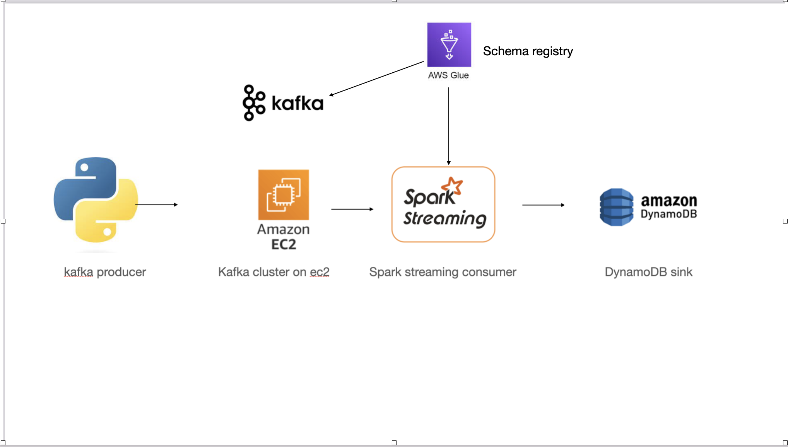

# Football Racing Barchart App
This project is an end-to-end implemntation of building a streaming application
## 📝 Table of Contents
- [System Architecture](#system-architecture)
- [Setup & Requirements](#-setup--requirements)
- [Usage](#-usage)

## System Architecture

## 🛠 Setup & Requirements
1. **Aws Account**: Ensure you have an active Aws account.
2. **Knowledge required**: Aws services (Dynamodb, Ec2, glue schema registry), kafka, spark structured streaming, python
3. **Python Libraries**: Install the required Python libraries:
   - fastavro
   - boto3
   - pyspark
   - kafka-python
   - yfinance 
   - pandas

## 🚀 Usage
1. **Pull Docker image**: run command docker pull jupyter/all-spark-notebook to have image pulled from Docker Hub in advance to speed up docker-compose process
2. **Run pyspark-on-jupyter containter**: Run docker-compose up
3. **Spin up Ec2 instance and install kafka**: Laucn an Ec2 instance with Ubuntu OS and run commands in `kafka_commands.txt` 
4. **Schema registry**: Set up approriate avro schema in aws glue schema registry to serialize and desrialize data send and received from kafka
5. **Set up DynamoDB**: Create a DynamoDB table
5. **Run code**: Run code from `producer.py` to produce message to kafka broker and run `streaming.py` to consume messages from kafka broker and write to dynamoDB with spark-submit --packages org.apache.spark:spark-sql-kafka-0-10_2.12:3.5.0 streaming.py

